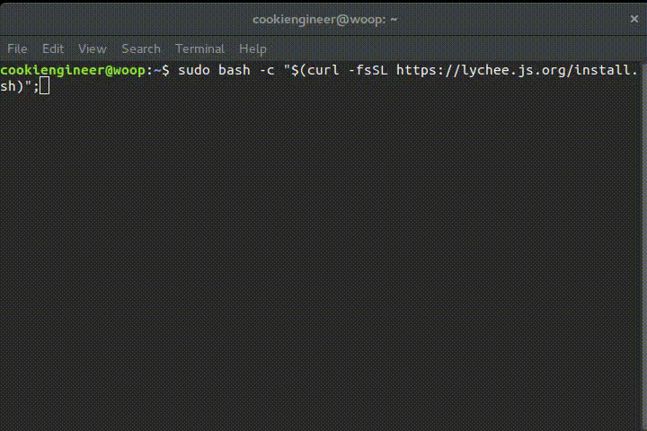

# lychee.js (2016-Q2)

brought to you as libre software with joy and pride by [Artificial Engineering](http://artificial.engineering).

Support our libre Bot Cloud via BTC [1CamMuvrFU1QAMebPoDsL3JrioVDoxezY2](bitcoin:1CamMuvrFU1QAMebPoDsL3JrioVDoxezY2?amount=0.5&label=lychee.js%20Support).


## Work-in-Progress (aka alpha beta gamma)

These are the things that we are currently working on:

- The lychee.js Editor is currently being refactored until the 2016-Q3 release.
- The lychee.js Guide is subject to change (to integrate the Editor).
- The lychee.js Strainer is being refactored until the 2016-Q4 release.
- The lychee.js CARTEL (AI implementation) is being refactored until the 2016-Q4 release.


## Overview

The following repositories are related to the lychee.js project:

- [lychee.js CARTEL](https://github.com/Artificial-Engineering/lycheejs-cartel.git) contains all academic work related to the CARTEL/ES-HyperNEAT concept (WIP).
- [lychee.js Guide](https://github.com/Artificial-Engineering/lycheejs-guide.git) contains architecture explanations and concept documentations (WIP).
- [lychee.js Runtime](https://github.com/Artificial-Engineering/lycheejs-runtime.git) contains all pre-compiled lychee.js Runtimes and Fertilizers.
- [lychee.js Library](https://github.com/Artificial-Engineering/lycheejs-library.git) contains the lychee.js Library (installable via `bower` and `npm`).
- [lychee.js Harvester](https://github.com/Artificial-Engineering/lycheejs-harvester.git) contains the lychee.js Harvester (forked from `/libraries/harvester`).
- [lychee.js Website](https://github.com/Artificial-Engineering/lycheejs-website.git) contains the lychee.js Website (hosted at [https://lychee.js.org](https://lychee.js.org)).
- [lychee.js Bundle](https://github.com/Artificial-Engineering/lycheejs-bundle.git) generates the OS-ready lychee.js Bundles (published at [releases](https://github.com/Artificial-Engineering/lycheejs-bundle/releases) section).
- [lychee.js Future](https://github.com/Artificial-Engineering/lycheejs-future.git) contains all Concepts and Ideas not yet finished.

The following accounts are related to the lychee.js project:

- [@cookiengineer](https://github.com/cookiengineer) is the core maintainer and founder of this project.
- [@humansneednotapply](https://github.com/humansneednotapply) is the account used by our software bots.


lychee.js is a [Next-Gen Isomorphic Application Engine](https://lychee.js.org/#!vision)
that offers a complete solution for prototyping, development,
maintenance and deployment of applications. The underlying
technology stack does not matter (HTML5, WebGL, OpenGL,
OpenGLES, libSDL) and is completely automated behind the
scenes.

The project's goal is to ease up and automate the design
and engineering process of applications through intelligent
software bots that learn from your application code. In
particular, we use a CARTEL/ES-HyperNEAT architecture
across a world-wide botnet with over 500k+ active computers
that constantly improve and learn from your code.

Every (not sandboxed) lychee.js Harvester connected to the
lychee.js peer cloud is contributing to the evolutionary
AI's knowledge and improves its capabilities for all others.

The development process is optimized for Blink-based
browsers (Chromium, Google Chrome, Opera) and their
developer tools. We honestly recommend NOT using Firefox
due to lack of developer and debugging tools nor has it
any remote debugging protocol.

We ain't doing HTML5 websites or single-page-webapps here.


## Platform / Fertilizer Support

The target platforms are described as so-called Fertilizers.
Those Fertilizers cross-compile everything automagically
using a serialized `lychee.Environment` that is setup in
each project's or library's `lychee.pkg` file.


| Target       | Fertilizer                   | Package   | armv7 |  x86  | x86\_64 |
|:-------------|:-----------------------------|:----------|:-----:|:-----:|:-------:|
| Browser      | html                         | zip, html |   ✓   |   ✓   |    ✓    |
| GNU/Linux    | html-nwjs, node, node-sdl    | bin       |   ✓   |   ✓   |    ✓    |
| OSX          | html-nwjs, node, node-sdl    | app, bin  |   ✗   |   ✗   |    ✓    |
| Windows      | html-nwjs, node, node-sdl    | exe       |   ✗   |   ✓   |    ✓    |
| Android      | html-webview, node, node-sdl | apk, bin  |   ✓   |   ✓   |    ✓    |
| BlackberryOS | html-webview, node, node-sdl | apk, bin  |   ✓   |   ✓   |    ✓    |
| FirefoxOS    | html-webview                 | zip       |   ✓   |   ✓   |    ✓    |
| iOS          | html                         |           |   ✗   |   ✗   |    ✗    |
| Ubuntu Touch | html-webview, node           | deb, bin  |   ✓   |   ✓   |    ✓    |

The iOS Fertilizer has currently no support for cross-compilation
due to XCode limitations. You can still create an own WebView
iOS app and use the `html` platform adapter.


## Quickstart

This is the directly-it-works-failsafe guide of how to install
the lychee.js Engine. For everything related to Bundles, Dev Ops,
Security, Deployments and Virtualization - please consult the
[lychee.js Guide](https://github.com/Artificial-Engineering/lycheejs-guide.git).





**1) Installation**

The Net Installer automatically installs the lychee.js Engine
on any UNIX-compatible machine (arm, x86 or amd64). The only
requirements beforehand are working `bash`, `curl` and `git`.

Note: OSX requires [brew](https://brew.sh) installed beforehand.

```bash
# Install lychee.js Engine into /opt/lycheejs
sudo bash -c "$(curl -fsSL https://lychee.js.org/install.sh)";
```


**2) Bootup**

The `lycheejs-harvester` integrates all projects with the
Software Bots. Start the `development` profile and open
`http://localhost:8080` in your Blink-based Browser.

```bash
cd /opt/lycheejs;

# Bootup lychee.js Harvester
lycheejs-harvester start development;
```


## Developer Guide

The lychee.js Guide tries to help developers to get started as
easy as possible. Please let us know if we can improve anything
in these documents by opening up an [Issue](https://github.com/Artificial-Engineering/lycheejs/issues/new).

- [lychee.js Guide](https://github.com/Artificial-Engineering/lycheejs-guide)


## Contributor Guide

- [Contribution Guide](./guides/CONTRIBUTION.md)
- [Codestyle Guide](./guides/CODESTYLE.md)
- [ECMAScript Guide](./guides/ECMASCRIPT.md)
- [Release Guide](./guides/RELEASE.md)


## License

lychee.js is (c) 2012-2016 Artificial-Engineering and released under MIT / Expat license.
The projects and demos are licensed under CC0 (public domain) license.
The runtimes are owned and copyrighted by their respective owners and may be shipped under a different license.

For further details take a look at the [LICENSE.txt](LICENSE.txt) file.

