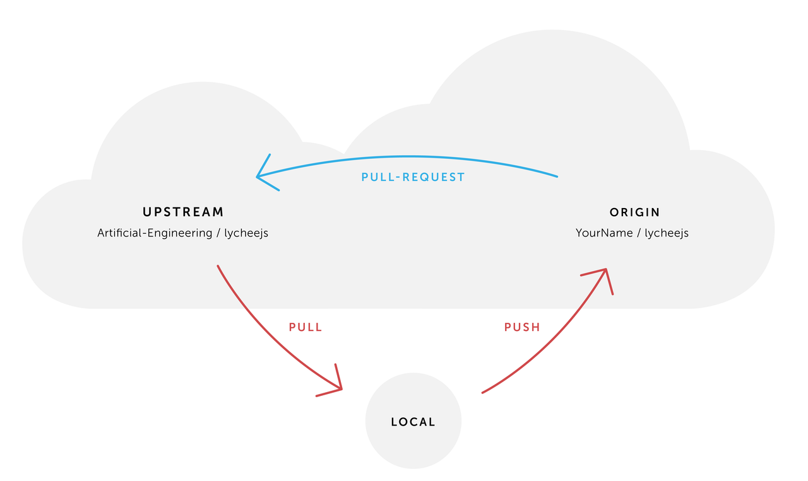

# Contribution Guide for lychee.js

Upstream/Downstream Management

- [Reserved Branches](#reserved-branches)

Workflow:

1. [Find an Issue](#find-an-issue)
2. [Assign an Issue](#assign-an-issue)
3. [Work on an Issue](#work-on-an-issue)
4. [Contribute a Feature](#contribute-a-feature)

Styles and Help:

- [Git Emojis](#git-emojis)
- [Get in Touch](#get-in-touch)


# Upstream/Downstream Management

## Reserved Branches

The main repository is hooked up with build bots. In order to not
conflict with any script, these branches are reserved and therefore
not accepted as branches of pull requests.

- the `development` branch is reserved for the master repository.
- the `humansneednotapply` branch is reserved for our GitHub Bot [@humansneednotapply](https://github.com/humansneednotapply).
- the `2XXX-QX` branch scheme is reserved for the master repository.


Upcoming feature requests are better stored in their own branch, so
we can make usage of pull requests on GitHub.

You have to fork the project on GitHub to your own repository.
This allows you to work on the feature beforehand, even while the
lychee.js team is undecided whether or not to merge in your features
already.


# Workflow

## Find an Issue

After you have forked the project you can start picking some issues you
want to help us on.

We use internally our own [GitHub Scrum Board](https://github.com/Artificial-Engineering/AE-github-scrumboard),
but that's not required for contributors. This extension just shows you
a neat Scrum Board with easier-to-use Issue Cards and the typical Scrum
columns with `backlog` (open and unlabeled), `todo`, `in-progress`,
`in-testing` and `done` (closed).

In any case, you can find all open issues in the Issues overview in
this repository.


## Assign an Issue

When you've found something you like to work on, you can assign an issue
to yourself so that the other lychee.js team members know what you're
working on. This helps them to help you and they love to help you :)


## Work on an Issue

Before you start to work, please make your IDE or Editor functional with
the `.editorconfig` file. We use this in order to prevent unnecessary
merge conflicts. For further information on how to setup your IDE with
it, please read the instructions at [http://editorconfig.org/#download](http://editorconfig.org/#download).

This example shows how the feature branches work. Replace `YourName`
accordingly with your GitHub username and `fancy-feature` accordingly with
a better description for the feature that you are working on. The best
name for a feature is the name of the equivalent issue title or its title
shrinked down to the minimum quintessence.

```bash
git clone git@github.com:YourName/lycheejs.git /opt/lycheejs;

cd /opt/lycheejs;
git checkout development;
git checkout -b fancy-feature;

# BEGIN of your own work
echo "foo" > ./worksimulation.txt;
git add worksimulation.txt;
git commit -m "Meaningful description";
# END of your own work

# After some days of work, make sure you are up-to-date
git pull https://github.com/Artificial-Engineering/lycheejs.git development;

# The final push to your github repository before your pull request
git push origin fancy-feature;
```

We use a triangular git workflow to ensure your work is being merged in
correctly and does not break existing tests and build toolchains.

This workflow basically means that you work only actively on your own
fork and not the upstream project itself. You always pull from the upstream
project, work on your tasks locally and push to your own fork on github.

After work being done you can use the Pull Request directly without any
merge conflicts. In the following example we use `upstream` as the upstream
reference and `origin` as the reference to your fork, as it is the
git-defaulted one.



```bash
git remote add upstream git@github.com:Artificial-Engineering/lycheejs.git;
git pull upstream development;
```

Your changes and commits have to been pushed to the origin (your own fork).
Since this is already defined as origin you can just push to it directly.

```bash
git push origin
```

If you want us to get your changes in the `upstream` remote, you have to
create a `pull request` from your own fork.
Try to avoid pulling from your own fork so you aren't getting out-of-date.
And never try to push directly to the `upstream` remote as you don't want
to break the `pull request` workflow!


## Contribute a Feature

Now you can go on GitHub to your repository and switch to the
`fancy-feature` branch. After you did that, there's a new green
button appearing with the label `Compare & pull request`.


Click on it, now you have to fill out the form with the description.
When you've finished your Issue and have created your pull request you have
to drag the Issue on the Scrum Board to `Done`.

After that we can now automatically merge in your implemented features.
If the merge was successful, the Issue is `Closed`.


# Styles and Help

## Git Emojis

Here are the rules for our commits, start each commit message with an emoji.

* Use Present tense (`Fix CSS` not `Fixed CSS`)
* Use imperative verbs (`Read the book` not `Reads the book`)
* Always reference the issues and pull requests (`More work on #123`)

Project-wide Emojis:

* :book: `:book:` Documentation
* :snowflake: `:snowflake:` Protoypical Implementation
* :rocket: `:rocket:` Feature Improvements
* :recycle: `:recycle:` Code Refactors
* :sparkles: `:sparkles:` Code Improvements
* :bug: `:bug:` Bug Fixes
* :gun: `:gun:` Test Fixes
* :lipstick: `:lipstick:` User Interface
* :hammer: `:hammer:` Security


## Get in Touch

Need help or just want to think out loud?
We look forward to hearing from you!

* Twitter: https://twitter.com/lycheejs
* Reddit:  https://reddit.com/r/lycheejs
* YouTube: https://www.youtube.com/user/lycheejs
* Email:   robot [insert an at here] artificial.engineering
* IRC:     #artificial-engineering at freenode

