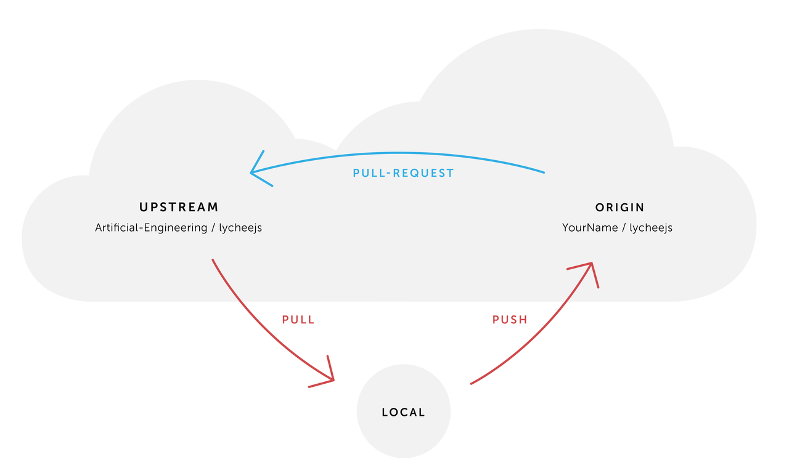

# Contributor Workflow

## Reserved Branches

The main repository is hooked up with build bots. In order to not
conflict with any script, these branches are reserved and therefore
not accepted as branches of pull requests.

- the `development` branch is reserved for the master repository.
- the `humansneednotapply` branch is reserved for our Artificial Intelligence [@humansneednotapply](https://github.com/humansneednotapply).
- the `2XXX-QX` branch scheme is reserved for the master repository.

Upcoming feature requests are better stored in their own branch, so
we can make usage of pull requests on GitHub.

You have to fork the project on GitHub to your own repository.
This allows you to work on the feature beforehand, even while the
lychee.js team is undecided whether or not to merge in your features
already.


## Workflow

### Find an Issue

After you have forked the project you can start picking some issues you
want to help us on. All issues are managed in the public and can be
seen in the [Issues](https://github.com/Artificial-Engineering/lycheejs)
section of the lychee.js Engine repository.


### Assign an Issue

When you've found something you like to work on, you can assign an issue
to yourself so that the other lychee.js Team Members know what you're
working on. This helps them to help you and they love to help you :)

If you have questions and want to discuss problems, feel free to join
our public IRC channel #artificial-engineering at freenode.

### Work on an Issue

Before you start to work, please make your IDE or Editor functional with
the `.editorconfig` file. We use this in order to prevent unnecessary
merge conflicts. For further information on how to setup your IDE with
it, please read the instructions at [http://editorconfig.org/#download](http://editorconfig.org/#download).

This example shows how the feature branches work. Replace `YourName`
accordingly with your GitHub username and `fancy-feature` accordingly with
a better description for the feature that you are working on. The best
name for a feature is the name of the equivalent issue title or its title
shrinked down to the minimum quintessence.

```bash
git clone git@github.com:YourName/lycheejs.git /opt/lycheejs;

cd /opt/lycheejs;
git checkout development;
git checkout -b fancy-feature;

# BEGIN of your own work
echo "foo" > ./worksimulation.txt;
git add worksimulation.txt;
git commit -m "Meaningful description";
# END of your own work

# After some days of work, make sure you are up-to-date
git pull "https://github.com/Artificial-Engineering/lycheejs.git" development;

# The final push to your github repository before your pull request
git push origin fancy-feature;
```

We use a triangular git workflow to ensure your work is being merged in
correctly and does not break existing tests and build toolchains.

This workflow basically means that you work only actively on your own
fork and not the upstream project itself. You always pull from the upstream
project, work on your tasks locally and push to your own fork on github.

After work being done you can use the Pull Request directly without any
merge conflicts. In the following example we use `upstream` as the upstream
reference and `origin` as the reference to your fork, as it is the
git-defaulted one.



```bash
git remote add upstream git@github.com:Artificial-Engineering/lycheejs.git;
git pull upstream development;
```

Your changes and commits have to been pushed to the origin (your own fork).
Since this is already defined as origin you can just push to it directly.

```bash
git push origin
```

If you want us to get your changes in the `upstream` remote, you have to
create a `pull request` from your own fork.
Try to avoid pulling from your own fork so you aren't getting out-of-date.
And never try to push directly to the `upstream` remote as you don't want
to break the `pull request` workflow!

### Contribute a Feature

Now you can go on GitHub to your repository and switch to the
`fancy-feature` branch. After you did that, there's a new green
button appearing with the label `Compare & pull request`.


Click on it, now you have to fill out the form with the description.
When you've finished your Issue and have created your pull request you have
to drag the Issue on the Scrum Board to `Done`.

After that we can now automatically merge in your implemented features.
If the merge was successful, the Issue is `Closed`.

## Git Commit Messages

Here are the rules for our commits, start each commit message with an emoji.

- Use Present Tense (`:bug: Fixes CSS` not `:bug: Fixed CSS`)
- Always reference the issues and pull requests (`:rocket: lychee.js Strainer supports #123`)

These are the Emojis that are automated in the build pipeline
and are assumed in all the [/bin/maintenance](/bin/maintenance)
scripts:

| Emoji          | Code             | Feature Category           |
|:--------------:|:----------------:|:--------------------------:|
| :book:         | `:book:`         | Documentation              |
| :construction: | `:construction:` | Build Pipeline Improvement |
| :snowflake:    | `:snowflake:`    | Protoypical Implementation |
| :rainbow:      | `:rainbow:`      | Code Refactor              |
| :sparkles:     | `:sparkles:`     | Code Wizardry              |
| :rocket:       | `:rocket:`       | Feature Improvement        |
| :ghost:        | `:ghost:`        | Security Improvement       |
| :satellite:    | `:satellite:`    | Network Improvement        |
| :robot:        | `:robot:`        | AI/ML Improvement          |
| :bug:          | `:bug:`          | Bug Fixes                  |
|:--------------:|:----------------:|:--------------------------:|

